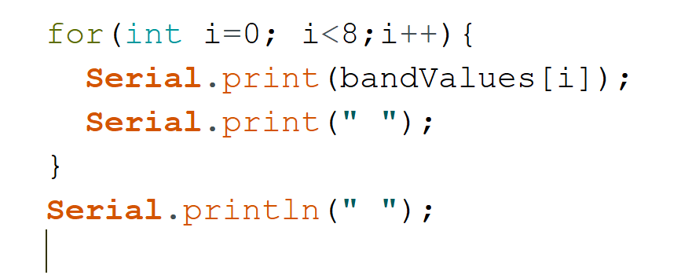

**Abstract**

The project aims to control a LED strip (for the demonstration I was
using 30 LEDs), remotely via local Wi-Fi communication. The
communication is made with the MQTT protocol, the broker being directly
installed on a NodeMCU. The mobile application (MQTT client) has been
entirely made to be Android compatible with Flutter and JAVA/Kotlin, and
from its interface one can control each LED individually, change their
colors, the duration of this color, turn them on/off, or use a preset,
such as "reactive music", which turns on the LEDs, or make them animate
according to the perceived sound signal. To achieve this effect, I used
an analog sound sensor, directly connected to the NodeMCU, and with the
help of an FTT library, I was able to convert the analog signal into a
digital frequency signal by applying the Fourier transform. Then I
animate the LEDS in accordance with the variations of amplitudes and
sound frequencies.

In fact, the main goal of my project was to link several IT domains
together, by developing a mobile application, using a wifi NodeMCU and
creating a communication via MQTT between the two, as well as to succeed
in controlling a LED strip thanks to the acoustic variations perceived
by the sound sensor.

{width="6.495138888888889in"
height="2.9430555555555555in"}

**Feasibility Study**

**Technically**

The project was relatively simple from a physical and electronic point
of view, with only a few direct connections between the microcontroller,
the sound sensor and the LED strip. The most complex part was the
coding, as we had to deal with a lot of problems, the first one being to
be able to execute a lot of tasks at the same time with the NodeMCU
without interrupting each other, using Threads. The other big challenge
was to be able to connect and manage my idea via mobile, but the mobile
applications or other existing solutions (such as Blynk), did not allow
to control each LED individually, and especially did not allow to
customize the effects/presets, and therefore it was impossible to make
the music reactivity preset. So, I designed my own mobile application
and used the MQTT protocol to ensure the communication.

Finally, the most complex part was probably to transform the analog
signal of the sound sensor, into a real sound signal, usable in
frequency to manage the LEDs, the first challenge was to find a library
that allowed it on NodeMCU, to learn how to use it and then, to measure
the existing noise at each of the 8 specific frequency bands, to adjust
the values to be as realistic as possible. As I couldn\'t find a similar
project with the tools I had, I had to experiment and test different
configurations by myself.

**Economically**

The cost was relatively low because bought on Aliexpress, I used a
NodeMCU ESP8266 version 3, a dozen of jumping wires, a strip of LED
Ws2812b, a sound sensor KY-037, an AC DC 5V 5A adapter, and a DC jack
adapter.

Finally, the biggest problem I met for my project, was the delay of
delivery, which was postponed many times, but fortunately I had started
to code the application on Android Studio and some code of the NodeMCU
on Arduino IDE before.

**Analysis and Design**

The project consists of a LED strip and a sound sensor connected to the
NodeMCU, all three powered by a 5V and 5A AC DC adapter.

The LEDs and the sensor can operate at 5V maximum, and each individual
LED consumes 20mA per color, which gives 20\*3(RGB) = 60mA. With 30 LEDs
for the example, I have a consumption of 60\*30 = 1800mA. The NodeMCU
with Wifi, and the complexity of the program consumes between 40 and
70mA on average, and the sound sensor about 10mA.

{width="6.495138888888889in"
height="2.484722222222222in"}The remaining amperage allows me to add LED
strips to the chain, if necessary, until I have about 80 LEDs. With the
WS2812b strip I used I did not need any additional resistor to connect
with the NodeMCU since the strip include resistor already.

{width="4.159027777777778in"
height="3.152083333333333in"}{width="2.7944444444444443in"
height="1.9444444444444444in"}

Sound Sensor KY-037

Here is the Android application I have coded to send commands to the
NodeMCU with MQTT.

I designed everything from scratch and used the **mqtt_client** library
(https://pub.dev/packages/mqtt_client), as well as flutter_colorpicker
(https://pub.dev/packages/flutter_colorpicker) to integrate a color
picker interface.

{width="2.25625in"
height="4.636805555555555in"}{width="2.2743055555555554in"
height="4.673611111111111in"}{width="2.2909722222222224in"
height="4.708333333333333in"}You will see how the application looks like
and how it works in details on the YouTube video:

**Communication Logic**

The communication logic between the mobile application and the NodeMCU
is done with a thread that constantly listens in the background to each
received MQTT topic, and thus will execute a specific code according to
the received value.

For example, if the MQTT client (Android application) sends on the topic
\"setPreset\" the value \"music_reactive\", the MQTT topic listener will
receive the MQTT packet, decrypt it and interpret the data thus
launching the music_reactive preset. If the user removes the preset, the
MQTT client will send a \"setPreset\" packet with the value \"none\".
This will be interpreted by the NodeMCU by stopping the current preset
instantly.

**Sound Calibration & Noise Reduction**

To calibrate the sound precepted by the sensor, I had to analyze the
frequency spectrum of each band I created in the code (as mentioned
later).

To do so, I used the **Serial Plotter** feature of Arduino IDE, to trace
a graph from the 8 different Serial sent by the NodeMCU as follows:

{width="3.3268121172353458in"
height="1.1373829833770779in"}

{width="5.546875546806649in"
height="3.5515616797900265in"}

On the above picture, you can see 8 different signals of different
colors, recording a silence room. I calculated the average value of each
of those signals and applied the noise reduction to reach a signal close
to 0. The noisiest signal for my test was the black and blue one, which
are the 2 highest frequency band. The blue signal are frequencies
between 5680Hz and 11360Hz, whereas the black signal is from 11360Hz up
to 22000Hz.

To get more detail on the functioning of the project and its design
please watch the YouTube video:

**https://www.youtube.com/watch?v=ddZAKp0ckGY**

**Structured Chart (Programs)**

The program structure is too complex to explain in one single chart.

**Coding**

**Libraries used:**

{width="3.142095363079615in"
height="1.028902012248469in"}Threads

Wi-Fi Management

MQTT Server/Client

LED Strip Management

Fourier transform for the sound signal

**Main variables**

{width="6.5in" height="3.2083333333333335in"}

**Class LedController**

{width="6.5in" height="2.673611111111111in"}

{width="6.5in"
height="0.25833333333333336in"}**Initialization of a LEDController for
each led, stored in a static array.**

**Function to turn Off the specific led (index)**

{width="3.272222222222222in"
height="0.8375in"}Set the color to black color (0,0,0)

**Preset functions to animate the leds**

{width="5.242357830271216in"
height="4.882225503062117in"}

**Sampling process in the music_reactive preset function**

We capture 512 samples from the sound sensor, and perform the Fourier
transform on them, we can access the transform signal frequencies values
in the vReal array.

After, I sort the real values into 8 specifics bands, from bandValues \[
0 \] to \[ 7 \], 0 being lowest frequencies, 7 the highest

{width="1.8895833333333334in"
height="2.9145833333333333in"}{width="6.5in"
height="4.9847222222222225in"}

To get the intervals values of each band, I calculated from octaves
minimum and maximum frequencies linked to the limit of 512/2 = 256
samples (Shannon Law) used in my project:

**Main Thread loop**

{width="6.5in"
height="6.270138888888889in"}Listen to the current preset name and
execute the related function as partially showed above, if no preset is
being executed the currentPreset value is "none", and therefore no
function is opened, until the user make a change from the mobile
interface.

The line **scheduler.scheduleDelayed(mainLoop, REFRESH_RATE);** is there
to make this thread keep looping at a specific refresh rate of normally
1ms, which can decrease to 0 when using the music_reactive preset to
prevent noise while capturing sound.

The class myMQTTBroker is used to perform every MQTT commands, by
default we are subscribed to every topics, and with the onData function
I can process the received data as follows:

{width="6.5in" height="0.8881944444444444in"}

**For example:**

If the topic received is name "setPreset", we will first terminate each
ledController threads, turn off the leds, set the new current preset
variable value to be the received data from the mobile application which
can be **rainbow, music_reactive, confetti, sinelon...**

The function **FastLED.show();** is used to specify a change in the led
configuration, so we notify it to show this change

{width="6.5in" height="4.3493055555555555in"}

**Function to initialize the Wi-Fi connection (this function is runned
during the setup part)**

The callback allow us to see from a serial monitor the status of the
connection

{width="6.5in" height="3.634027777777778in"}

**Function to setup the LED strip, add the main thread loop to our
scheduler, and create a LedController for each LED and add its thread to
the scheduler.**

{width="6.5in" height="1.4416666666666667in"}

{width="6.5in" height="2.097916666666667in"}

Above the setup and loop functions, with the comments to explain each
line. As you can see the loop function only contains the execution of
the scheduler (thread manager), as the main loop is contained inside the
scheduler itself.

**Application Coding**

13 different classes with one main service running the MQTT client in
background

{width="2.047222222222222in"
height="3.703472222222222in"}{width="3.890173884514436in"
height="3.6347222222222224in"}

I used the Flutter Framework to program my Android application combined
with some JAVA/Kotlin, which allows me to make the application
cross-platform (Android, iOS, Chrome\...)

**Outcomes**

Here are some examples of the result, for more details go to the YouTube
video of the project: <https://www.youtube.com/watch?v=ddZAKp0ckGY>

{width="2.928472222222222in"
height="1.4638888888888888in"}

{width="2.8090277777777777in"
height="1.4972222222222222in"}

Simple Color Blinking Confetti Preset (Random change of led)

{width="3.0034722222222223in"
height="1.5020833333333334in"}{width="2.9854166666666666in"
height="1.5069444444444444in"}

Juggle Preset Sinelon Preset

{width="1.8430555555555554in"
height="3.295138888888889in"}

**IOT Relation**

This project is mainly functional in local, the user who is connected on
the same WIFI network can therefore control via his/her phone the LEDs.

But to make the project even more connected, and controllable from the
public network, we have several solutions:

\- We use the NAT of our router and open a specific port to make
communication possible with the NodeMCU from the public network using
the public IP address of our router or a solution like dyndns

\- We can use an existing solution like Blynk or create our own server

All this will allow us to do the same as locally from the public
network, however it is very uninteresting to control this kind of LED
from outside.

We can however use the sound sensor to capture the sound of the room,
and access it from anywhere.

To do so, we can use another thread to send in the background the sound
signal data perceived by the sensor, but in this case instead of
separating the signal in 8 frequency bands, it is more interesting to
send the whole audio spectrum with each amplitude for each frequency so
that the digital sound signal sent to the server is of the best possible
quality.

In this way we can listen live to what is happening in the room, have
access to statistics and history, to see when there was a sound peak, so
it become a real IOT device.

**Summary**

In summary, the project was very challenging and fun to do, I was able
to combine several areas of learning both mobile developments, IOT,
programming under Arduino / NodeMCU, management and creation of MQTT,
management of a sound sensor and how to convert the analog signal into
frequency signal.

Basically, the project was very ambitious, and it was difficult in such
a short time to develop the application, the code, and to understand the
physics of the signals in order to achieve the final goal. My first
obstacle as mentioned before, was the limitation of the NodeMCU and
Arduinos in general to not be able to do several tasks at the same time
(because no thread management). So, I had to look for specific
libraries, and learn to use them. The same for the FFT function to do
the Fourier transform, which the most known could not compile with the
NodeMCU because the library was assembled in AVR code, so I found an
alternative library, but less complete which took me a lot of time to
adjust and understand how to get my result with this one.

While working on my project I realized that the management of the led
strips was easier with an Arduino for the simple reason that the
management of the analog signals for the sound sensor is more reliable
and above all there is more input which would have allowed me to add a
potentiometer to measure and adjust the noise levels. However, the
NodeMCU presents a more versatile and complete solution and allows
remote control via Wi-Fi. Anyway, I still managed to adjust the noise on
NodeMCU by testing and using the FFT library.

**References**

<https://github.com/PRosenb/DeepSleepScheduler#readme>

<https://github.com/marcouderzo/ArduinoFFT>

<https://github.com/FastLED/FastLED/wiki/Overview>

<https://github.com/martin-ger/uMQTTBroker>

<https://randomnerdtutorials.com/guide-for-ws2812b-addressable-rgb-led-strip-with-arduino/>

<https://pub.dev/packages/flutter_colorpicker>

<https://pub.dev/packages/mqtt_client>
